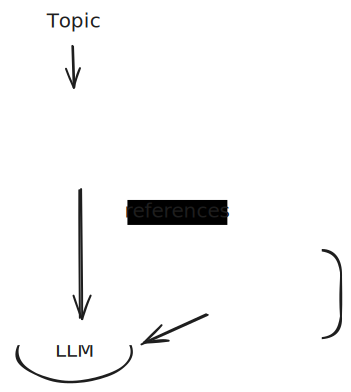

# Tutorial: Agent Using Agent on IVCAP

> Please note, that this tutorial assumes that you already familiar with
the basics of developing and deploying IVCAP services. If not, you may first
check out the [Building a Gene Ontology (GO) Term Mapper Tool](https://github.com/ivcap-works/gene-onology-term-mapper) tutorial

In this tutorial we will create two simple agents, a report writer
and a fact checker assessing the references used in the report.



## Example Output

```bash
% cd report_writer && poetry ivcap job-exec tests/solar.json
Running: ivcap context get account-id
Creating job 'https://develop.ivcap.net/1/services2/urn:ivcap:service:907e5d00-98ad-529d-a037-ed6b58cdc712/jobs'
Job 'urn:ivcap:job:46f37811-4406-42ca-8232-aafce1287646' accepted, but no result yet. Polling in 10 seconds.
Status: 'executing'. Next poll in 10 seconds.
{
  "account": "urn:ivcap:account:45a06508-5c3a-4678-8e6d-0000000000",
  "id": "urn:ivcap:job:46f37811-4406-42ca-8232-aafce1287646",
  ...
```

 with the content section formatted in YAML:

```yaml
topic: The Solar System
content: >-
  The Solar System consists of the Sun and all objects bound to it by gravity,
  including eight major planets, their moons, dwarf planets, asteroids, and
  ...

  References:

  [1] NASA Solar System Exploration -
  https://solarsystem.nasa.gov/solar-system/our-solar-system/overview/

  [2] European Space Agency (ESA) -
  https://www.esa.int/Science_Exploration/Space_Science/Solar_System

references:
  - reference: >-
      [1] NASA Solar System Exploration -
      https://solarsystem.nasa.gov/solar-system/our-solar-system/overview/
    assessment: >-
      **Assessment of Reference Credibility and Relevance**

      **Reference:**

      [1] NASA Solar System Exploration -
      https://solarsystem.nasa.gov/solar-system/our-solar-system/overview/

      **Credibility:**

      This reference is highly credible. NASA (National Aeronautics and Space
      Administration) is a leading authority in space science and exploration.
      ...

      **Relevance:**

      The referenced page provides an overview of the solar system, including
      its structure, composition, and key facts about its components. It is
      ...

      **Conclusion:**

      This reference is both credible and highly relevant for research or
      educational purposes related to the solar system.
  - reference: >-
      [2] European Space Agency (ESA) -
      https://www.esa.int/Science_Exploration/Space_Science/Solar_System
    assessment: >-
      ...
```

## Fact Checker

This agent takes a list of references as input and for every one of them, it asks an LLM to provide it with an assessment using the following prompt.

  * __system__: You are a critical academic reviewer.
  * __user__: Assess the credibility and relevance of this reference: {ref}

The implementation can be found in the [fact_checker](./fact_checker/) subdirectory.

The [fact_checker.py](./fact_checker/fact_checker.py) implements the agent's functionality as an IVCAP _lambda_ service. The remaining files, [pyproject.toml](./fact_checker/pyproject.toml), [Dockerfile](./fact_checker/Dockerfile) and [Makefile](./fact_checker/Makefile) support the standard IVCAP testing and deployment process with some test files in [fact_checker/tests](./fact_checker/tests/) for local testing.

## Report Writer

The report writer in the [report_writer](./report_writer/) subdirectory follows a very similar script.

The initial report on a specific topic is sent to an LLM using the
following prompts:

  * __system__: You are a science writer.
  * __user__: Write a concise summary about "{topic}". <br>
  Include at least 2 well-formatted references at the end, like:<br>
    [1] Author/Source - URL <br>
    [2] Author/Source - URL

After receiving the reply from the LLM, the included references are processed by `check_references`:

```python
def check_references(report_text: str, request: ReportRequest, ctxt: JobContext):
    """Check the references using the fact checker service."""

    # Find the references which are lines starting with '['
    references = [line.strip() for line in report_text.splitlines() if line.strip().startswith("[")]

    ...

    # get the id of the fact checking agent to use
    fact_checker = request.fact_checker
    agent_id = fact_checker.agent_id
    if not agent_id:
        raise ValueError("Fact checker agent ID is required")
    # use the IVCAP client provided through the JobContext
    agent = ctxt.ivcap.get_agent(agent_id)
    # create a schema checked request for this agent
    req_model = agent.request_model
    req = req_model(
        references=references,
        model=fact_checker.model,
        temperature=fact_checker.temperature,
    )
    # Call the agent and wait for a reply
    job = agent.exec_agent(req)
    if not job.succeeded:
        raise RuntimeError(f"Fact checking job failed: {job.error}")

    # extract result and return
    result = job.result["results"]
    return result
```
